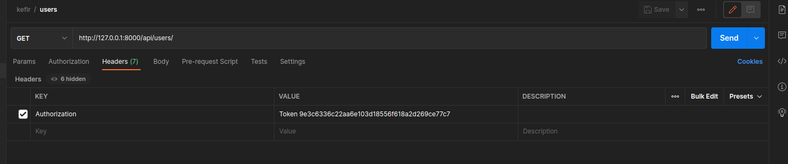

# Инструкция по разворачиванию приложения

#### Окружение проекта:
  * python 3.8
  * Django 3.2.5
  * djangorestframework 3.13.1
  * drf-yasg 1.20.0

#### Склонируйте репозиторий с помощью git:
```sh
git clone https://github.com/PontificSalivan/kefir
```

#### Перейдите в директорию проекта:
```sh
cd ./kefir
```
#### Запустите команду docker:
```sh
docker-compose build
```
или
```sh
sudo docker-compose build
```
#### Создайте суперпользователя:
```sh
docker-compose run web python manage.py createsuperuser
```
или
```sh
sudo docker-compose run web python manage.py createsuperuser
```
#### Заполните поля регистрации ( почта необязательна ):
```sh
Username (leave blank to use ...): 
Email address: 
Password: 
Password (again): 
Superuser created successfully. 
```

#### Запустите приложение (localhost: http://0.0.0.0:8000/):
```sh
docker-compose up
```
или
```sh
sudo docker-compose up
```

# Документация по использованию API

* #### Символ % означает, что нужно вместо него вставить данные
* #### Ссылка на коллекцию postman - https://www.getpostman.com/collections/c44e428db4dd28c7907c
* #### Swagger - http://127.0.0.1:8000/swagger/
### Чтобы получить токен пользователя: 
* Request method: POST
* URL: http://localhost:8000/api/login/
* Body: 
    * username: имя пользователя в админке django
    * password: пароль пользователя в админке django
* Консольная команда:
```
curl --location --request POST 'http://localhost:8000/api/login/' \
--form 'username=%' \
--form 'password=%'
```
#### Последующие запросы идут с данным выше токеном в Headers как показано ниже:


### Чтобы создать пользователя:
* Request method: POST
* URL: http://localhost:8000/api/private/users/
* Headers:
   *  Authorization: Token %
* Body:
    * name: имя опроса
    * secret_word: секретное слово
    * user_id: id логина пользователя 
* Консольная команда: 
```
curl --location --request POST 'http://localhost:8000/api/private/users/' \
--header 'Authorization: Token %' \
--form 'name=%' \
--form 'secret_word=%' \
--form 'user_id=%'
```
Примечание: Администратор имеет право создавать пользователя для любого id, пользователь же только для своего собственного id

### Получить полную информацию о пользователе ( только для админов ):
* Request method: GET
* URL: http://localhost:8000/api/private/users/[user_id]/
* Headers:
    * Authorization: Token %
* Params:
    * user_id
* Консольная команда:
```
curl --location --request PATCH 'http://localhost:8000/api/private/users/[user_id]/' \
--header 'Authorization: Token %' \
```

### Обновить информацию о пользователе ( только для админов ):
* Request method: PATCH
* URL: http://localhost:8000/api/private/users/[user_id]/
* Headers:
    * Authorization: Token %
* Params:
    * user_id
* Body:
    * name: имя опроса
    * secret_word: секретное слово
    * favorite_colour: любимый цвет
    * favorite_food: любимая еда
* Консольная команда:
```
curl --location --request PATCH 'http://localhost:8000/api/private/users/[user_id]/' \
--header 'Authorization: Token %' \
--form 'name=%' \
--form 'secret_word=%' \
--form 'favorite_colour=%' \
--form 'favorite_food=%'
```

### Удалить пользователя ( только для админов ):
* Request method: DELETE
* URL: http://localhost:8000/api/private/users/[user_id]/
* Headers:
    * Authorization: Token %
* Params:
    * user_id
Консольная команда:
```
curl --location --request DELETE 'http://localhost:8000/api/private/users/[user_id]/' \
--header 'Authorization: Token %'
```

### Просмотр всех пользователей с полной информацией о них ( только для админов ):
* Request method: GET
* URL: http://localhost:8000/api/private/users/
* Headers:
    * Authorization: Token %
* Консольная команда:
```
curl --location --request GET 'http://localhost:8000/api/private/users/' \
--header 'Authorization: Token %'
```

### Просмотр всех пользователей с частичной информацией о них:
* Request method: GET
* URL: http://localhost:8000/api/users/
* Headers:
    * Authorization: Token %
* Консольная команда:
```
curl --location --request GET 'http://localhost:8000/api/users/' \
--header 'Authorization: Token %'
```

### Просмотр полной информации о текущем пользователе ( с дополнительным полем, является ли он админом ):
* Request method: GET
* URL: http://localhost:8000/api/users/current/
* Headers:
    * Authorization: Token %
* Консольная команда:
```
curl --location --request POST 'http://localhost:8000/api/users/current/' \
--header 'Authorization: Token %' \
```

### Частично обновить информацию о пользователе:
* Request method: PATCH
* URL: http://localhost:8000/api/users/[user_id]/
* Headers:
    * Authorization: Token %
* Params:
    * user_id
* Body:
    * name: имя опроса
    * favorite_colour: любимый цвет
    * favorite_food: любимая еда
* Консольная команда:
```
curl --location --request PATCH 'http://localhost:8000/api/users/[user_id]/' \
--header 'Authorization: Token %' \
--form 'name=%' \
--form 'favorite_colour=%' \
--form 'favorite_food=%'
```
Примечание: Администратор имеет право изменять информацию любого пользователя, обычный пользователь же имеет право изменять только свою

### Выход из системы с удалением токена:
* Request method: GET
* URL: http://localhost:8000/api/logout/
* Headers:
    * Authorization: Token %
Консольная команда:
```
curl --location --request DELETE 'http://localhost:8000/api/logout/' \
--header 'Authorization: Token %'
```